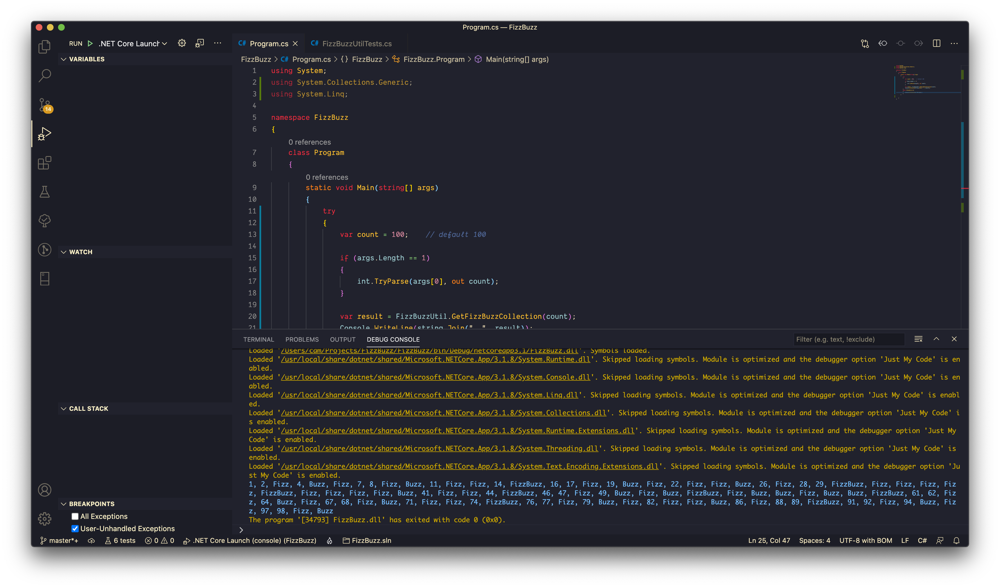
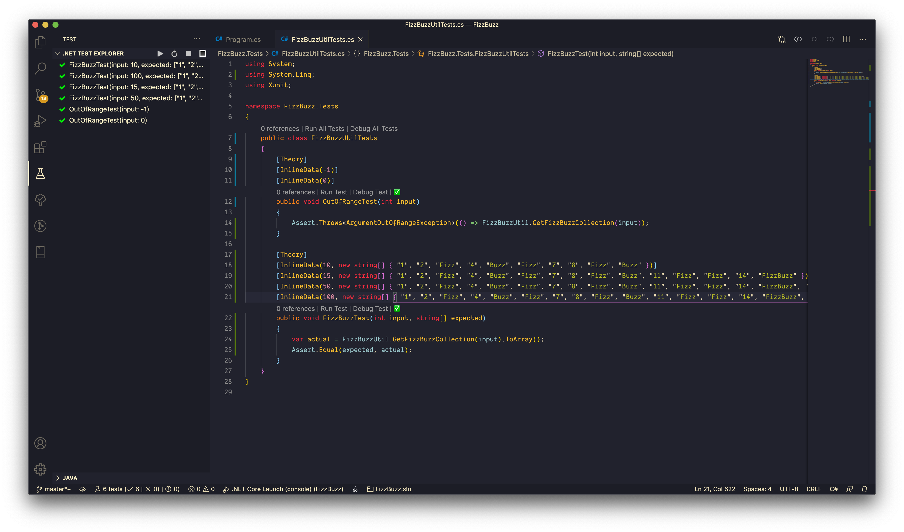

# FizzBuzz

Replace certain values however if any of the following conditions are meet,

1. A number is Fizz it is divisible by 3 or it has a 3 in it.
2. A number is Buzz it is divisible by 5 or it has a 5 in it.
3. A number is FizzBuzz it is divisible by 3 and 5, or if it has a 3 and 5 in it.

Sample print result:

~~1 2 Fizz 4 Buzz Fizz 7 8 Fizz Buzz 11 Fizz 13 14 FizzBuzz ......~~

`1 2 Fizz 4 Buzz Fizz 7 8 Fizz Buzz 11 Fizz Fizz 14 FizzBuzz ......`

## Application Calling Screen Capture

Calling result  

Unit test  

